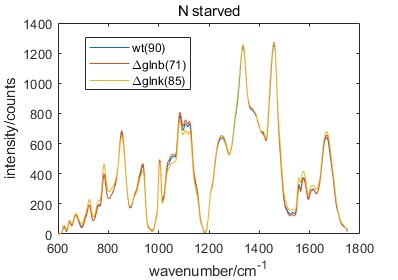

```matlab
plot (x,mean(log_wt,2))
hold on
plot (x,mean(log_glnb,2))
plot (x,mean(log_glnk,2))
xlabel('wavenumber/cm^{-1}')
ylabel('intensity/counts')
legend('wt','\Deltaglnb','\Deltaglnk')
legend('wt(84)','\Deltaglnb(83)','\Deltaglnk(78)')
% mean spectrum of the samples(number),
title('in the condition of ammonium sufficiency, exponential growth')
```


```matlab
plot (x,mean(ro_wt,2))
hold on
plot (x,mean(ro_glnb,2))
plot (x,mean(ro_glnk,2))
xlabel('wavenumber/cm^{-1}')
ylabel('intensity/counts')
legend('wt','\Deltaglnb','\Deltaglnk')
legend('wt(76)','\Deltaglnb(88)','\Deltaglnk(88)')
% mean spectrum of the samples(number),
title('in the condition of ammonium running out')
```

```matlab
plot (x,mean(sta_wt,2))
hold on
plot (x,mean(sta_glnb,2))
plot (x,mean(sta_glnk,2))
xlabel('wavenumber/cm^{-1}')
ylabel('intensity/counts')
legend('wt','\Deltaglnb','\Deltaglnk')
legend('wt(90)','\Deltaglnb(71)','\Deltaglnk(85)')
% mean spectrum of the samples(number),
title('in the condition of ammonium starvation')

```



