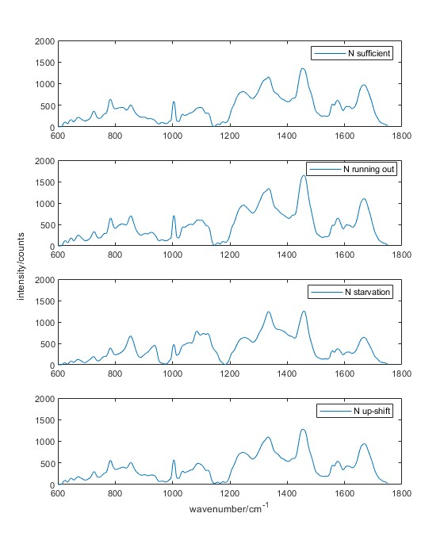
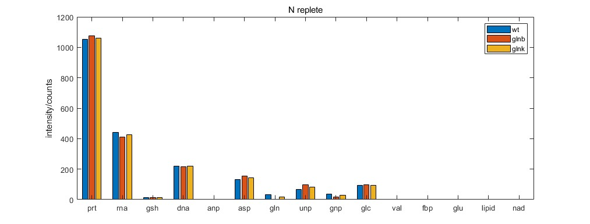

```matlab
plot (x,mean(log_wt,2))
hold on
plot (x,mean(log_glnb,2))
plot (x,mean(log_glnk,2))
xlabel('wavenumber/cm^{-1}')
ylabel('intensity/counts')
legend('wt','\Deltaglnb','\Deltaglnk')
legend('wt(84)','\Deltaglnb(83)','\Deltaglnk(78)')
% mean spectrum of the samples(number),
title('in the condition of ammonium sufficiency, exponential growth')
```


```matlab
plot (x,mean(ro_wt,2))
hold on
plot (x,mean(ro_glnb,2))
plot (x,mean(ro_glnk,2))
xlabel('wavenumber/cm^{-1}')
ylabel('intensity/counts')
legend('wt','\Deltaglnb','\Deltaglnk')
legend('wt(76)','\Deltaglnb(88)','\Deltaglnk(88)')
% mean spectrum of the samples(number),
title('in the condition of ammonium running out')
```

```matlab
plot (x,mean(sta_wt,2))
hold on
plot (x,mean(sta_glnb,2))
plot (x,mean(sta_glnk,2))
xlabel('wavenumber/cm^{-1}')
ylabel('intensity/counts')
legend('wt','\Deltaglnb','\Deltaglnk')
legend('wt(90)','\Deltaglnb(71)','\Deltaglnk(85)')
% mean spectrum of the samples(number),
title('in the condition of ammonium starvation')

```


```matlab
plot (x,mean(upsft_wt,2))
hold on
plot (x,mean(upsft_glnb,2))
plot (x,mean(upsft_glnk,2))
xlabel('wavenumber/cm^{-1}')
ylabel('intensity/counts')
legend('wt','\Deltaglnb','\Deltaglnk')
legend('wt(85)','\Deltaglnb(80)','\Deltaglnk(84)')
% mean spectrum of the samples(number),
title('in the condition of ammonium up-shift')
```


```matlab
datasetall = [log_wt,log_glnb,log_glnk,ro_wt,ro_glnb,ro_glnk,sta_wt,sta_glnb,sta_glnk,upsft_wt,upsft_glnb,upsft_glnk];
quantiles = [];
numbers = [];
numbers(1) = width(log_wt);
numbers(2) = width(log_glnb);
numbers(3) = width(log_glnk);
numbers(4) = width(ro_wt);
numbers(5) = width(ro_glnb);
numbers(6) = width(ro_glnk);
numbers(7) = width(sta_wt);
numbers(8) = width(sta_glnb);
numbers(9) = width(sta_glnk);
numbers(10) = width(upsft_wt);
numbers(11) = width(upsft_glnb);
numbers(12) = width(upsft_glnk);
quantiles(1) =0;

for n = 1:12
quantiles(n+1) = sum(numbers(1:n));
end
[coeff,score,latent] = pca(datasetall');

for n = 1:3
scatter3 (score(quantiles(n)+1:quantiles(n+1),1),score(quantiles(n)+1:quantiles(n+1),2),score(quantiles(n)+1:quantiles(n+1),3),12,'o','filled')
hold on
end

for n = 4:6
scatter3 (score(quantiles(n)+1:quantiles(n+1),1),score(quantiles(n)+1:quantiles(n+1),2),score(quantiles(n)+1:quantiles(n+1),3),12,'^')
hold on
end
pc1 = latent(1)./sum(latent); % pc1 = 85.3%
pc2 = latent(2)./sum(latent); % pc2 = 10.8%
pc3 = latent(3)./sum(latent); % pc3 = 1.1%
xlabel('pc1 85.3')
ylabel('pc1 10.7')
zlabel('pc1 0.01')
legend ('log wt','log glnb','log glnk','ro wt','ro glnb','ro glnk')

```


```matlab

for n = 7:9
scatter3 (score(quantiles(n)+1:quantiles(n+1),1),score(quantiles(n)+1:quantiles(n+1),2),score(quantiles(n)+1:quantiles(n+1),3),12,'x')
hold on
end
```


```matlab

for n = 10:12
scatter3 (score(quantiles(n)+1:quantiles(n+1),1),score(quantiles(n)+1:quantiles(n+1),2),score(quantiles(n)+1:quantiles(n+1),3),12,'square')
hold on
end
```

```matlab
% Spectral differences between ammonium concentration are distinguishable;
% Spectra are similar between wt, glnb, glnk, in different ammonium concentrations;


subplot (411)
plot (x,mean(log_wt,2))
legend ('N sufficient')

subplot (412)
plot (x,mean(ro_wt,2))
legend ('N running out')

subplot (413)
plot (x,mean(sta_wt,2))
legend ('N starvation')

subplot (414)
plot (x,mean(upsft_wt,2))
legend ('N up-shift')
xlabel('wavenumber/cm^{-1}')
ylabel('intensity/counts')

% comparison on spectrum in different ammonium concentrations, wt;
```


```matlab
% deconvolution and comparison;
% note the deconvolution result is based on 15 components, without keta-glutarate and 6-phosphateglucose;

% on mean spectrum:
A = [];
cvx_begin
variable A(15,1)
minimize (norm(tbl_ele_adj*A - mean(log_wt,2)));
subject to
A>= 0;
cvx_end
param_log_mean (:,1) = A;
A = [];
cvx_begin
variable A(15,1)
minimize (norm(tbl_ele_adj*A - mean(log_glnb,2)));
subject to
A>= 0;
cvx_end
param_log_mean (:,2) = A;
A = [];
cvx_begin
variable A(15,1)
minimize (norm(tbl_ele_adj*A - mean(log_glnk,2)));
subject to
A>= 0;
cvx_end
param_log_mean (:,3) = A;

subplot (311)
plot (x,mean(log_wt,2))
hold on
plot (x,tbl_ele_adj*param_log_mean(:,1))
legend ('cell','fitting')
ylabel('wt')
subplot (312)
plot (x,mean(log_glnb,2))
hold on
plot (x,tbl_ele_adj*param_log_mean(:,2))
ylabel('glnb')
subplot (313)
plot (x,mean(log_glnk,2))
hold on
plot (x,tbl_ele_adj*param_log_mean(:,3))
ylabel('glnk')

bar(param_log_mean)
xticklabels({"prt" "rna" "gsh" "dna" "anp" "asp" "gln" "unp" "gnp" "glc" "val" "fbp" "glu" "lipid" "nad"});
legend ('wt','glnb','glnk')
ylabel('intensity/counts')
% note: small values are not comparable
```
.


```matlab
y_scale = 2000;
perc_log_wt = tbl_ele_adj.*param_log_mean(:,1)';
perc_log_wt(:,16) = abs(tbl_ele_adj*param_log_mean(:,1)-mean(log_wt,2));
perc_log_wt = perc_log_wt([peak_position],:);

for n = 1:10
perc_log_wt(n,:) = perc_log_wt(n,:)./sum(perc_log_wt(n,:));
end

perc_log_wt = perc_log_wt'.*y_scale;

subplot (311)
plot (x,mean(log_wt,2))
hold on
a = bar (x(peak_position),perc_log_wt,'stacked');
colors = hot(16);
for i = 1:length(a)
a(i).FaceColor = colors(i, :);
a(i).FaceAlpha = 0.3;
end
ylabel('wt')
legend ('', 'prt', 'rna' ,'gsh' ,'dna' ,'anp' ,'asp' ,'gln' ,'unp' ,'gnp' ,'glc', 'val' ,'fbp' ,'glu' ,'lipid', 'nad','error')

perc_log_glnb = tbl_ele_adj.*param_log_mean(:,2)';
perc_log_glnb(:,16) = abs(tbl_ele_adj*param_log_mean(:,2)-mean(log_glnb,2));
perc_log_glnb = perc_log_glnb([peak_position],:);
for n = 1:10
perc_log_glnb(n,:) = perc_log_glnb(n,:)./sum(perc_log_glnb(n,:));
end
perc_log_glnb = perc_log_glnb'.*y_scale;
subplot (312)
plot (x,mean(log_glnb,2))
hold on
a = bar (x(peak_position),perc_log_glnb,'stacked');
colors = hot(16);
for i = 1:length(a)
a(i).FaceColor = colors(i, :);
a(i).FaceAlpha = 0.3;
end
ylabel('glnb')

perc_log_glnk = tbl_ele_adj.*param_log_mean(:,3)';
perc_log_glnk(:,16) = abs(tbl_ele_adj*param_log_mean(:,3)-mean(log_glnk,2));
perc_log_glnk = perc_log_glnk([peak_position],:);

for n = 1:10
perc_log_glnk(n,:) = perc_log_glnk(n,:)./sum(perc_log_glnk(n,:));
end

perc_log_glnk = perc_log_glnk'.*y_scale;

subplot (313)
plot (x,mean(log_glnk,2))
hold on
a = bar (x(peak_position),perc_log_glnk,'stacked');
colors = hot(16);
for i = 1:length(a)
a(i).FaceColor = colors(i, :);
a(i).FaceAlpha = 0.3;
end
ylabel('glnk')
xlabel ('wavenumber/cm^{-1}')
```


```matlab
A = [];
cvx_begin
variable A(15,1)
minimize (norm(tbl_ele_adj*A - mean(ro_wt,2)));
subject to
A>= 0;
cvx_end
param_ro_mean (:,1) = A;
A = [];
cvx_begin
variable A(15,1)
minimize (norm(tbl_ele_adj*A - mean(ro_glnb,2)));
subject to
A>= 0;
cvx_end
param_ro_mean (:,2) = A;
A = [];
cvx_begin
variable A(15,1)
minimize (norm(tbl_ele_adj*A - mean(ro_glnk,2)));
subject to
A>= 0;
cvx_end
param_ro_mean (:,3) = A;
bar(param_ro_mean)
xticklabels({"prt" "rna" "gsh" "dna" "anp" "asp" "gln" "unp" "gnp" "glc" "val" "fbp" "glu" "lipid" "nad"});
legend ('wt','glnb','glnk')
ylabel('intensity/counts')
title ('N run-out')
% note: small values are not comparable
```
.


```matlab

perc_ro_wt = tbl_ele_adj.*param_ro_mean(:,1)';
perc_ro_wt(:,16) = abs(tbl_ele_adj*param_ro_mean(:,1)-mean(ro_wt,2));
perc_ro_wt = perc_ro_wt([peak_position],:);
for n = 1:10
perc_ro_wt(n,:) = perc_ro_wt(n,:)./sum(perc_ro_wt(n,:));
end
perc_ro_wt = perc_ro_wt'.*y_scale;
subplot (311)
plot (x,mean(ro_wt,2))
hold on
a = bar (x(peak_position),perc_ro_wt,'stacked');
colors = hot(16);
for i = 1:length(a)
a(i).FaceColor = colors(i, :);
a(i).FaceAlpha = 0.3;
end
ylabel('wt')
legend ('', 'prt', 'rna' ,'gsh' ,'dna' ,'anp' ,'asp' ,'gln' ,'unp' ,'gnp' ,'glc', 'val' ,'fbp' ,'glu' ,'lipid', 'nad','error')
perc_ro_glnb = tbl_ele_adj.*param_ro_mean(:,2)';
perc_ro_glnb(:,16) = abs(tbl_ele_adj*param_ro_mean(:,2)-mean(ro_glnb,2));
perc_ro_glnb = perc_ro_glnb([peak_position],:);
for n = 1:10
perc_ro_glnb(n,:) = perc_ro_glnb(n,:)./sum(perc_ro_glnb(n,:));
end
perc_ro_glnb = perc_ro_glnb'.*y_scale;
subplot (312)
plot (x,mean(ro_glnb,2))
hold on
a = bar (x(peak_position),perc_ro_glnb,'stacked');
colors = hot(16);
for i = 1:length(a)
a(i).FaceColor = colors(i, :);
a(i).FaceAlpha = 0.3;
end
ylabel('glnb')
legend ('', 'prt', 'rna' ,'gsh' ,'dna' ,'anp' ,'asp' ,'gln' ,'unp' ,'gnp' ,'glc', 'val' ,'fbp' ,'glu' ,'lipid', 'nad','error')

perc_ro_glnk = tbl_ele_adj.*param_ro_mean(:,3)';
perc_ro_glnk(:,16) = abs(tbl_ele_adj*param_ro_mean(:,3)-mean(ro_glnb,2));
perc_ro_glnk = perc_ro_glnk([peak_position],:);
for n = 1:10
perc_ro_glnk(n,:) = perc_ro_glnk(n,:)./sum(perc_ro_glnk(n,:));
end
perc_ro_glnk = perc_ro_glnk'.*y_scale;
subplot (313)
plot (x,mean(ro_glnk,2))
hold on
a = bar (x(peak_position),perc_ro_glnk,'stacked');
colors = hot(16);
for i = 1:length(a)
a(i).FaceColor = colors(i, :);
a(i).FaceAlpha = 0.3;
end
ylabel('glnk')
legend ('', 'prt', 'rna' ,'gsh' ,'dna' ,'anp' ,'asp' ,'gln' ,'unp' ,'gnp' ,'glc', 'val' ,'fbp' ,'glu' ,'lipid', 'nad','error')
xlabel ('wavenumber/cm^{-1}')
title ('N run-out')
```


```matlab
A = [];
cvx_begin
variable A(15,1)
minimize (norm(tbl_ele_adj*A - mean(sta_wt,2)));
subject to
A>= 0;
cvx_end
param_sta_mean (:,1) = A;
A = [];
cvx_begin
variable A(15,1)
minimize (norm(tbl_ele_adj*A - mean(sta_glnb,2)));
subject to
A>= 0;
cvx_end
param_sta_mean (:,2) = A;
A = [];
cvx_begin
variable A(15,1)
minimize (norm(tbl_ele_adj*A - mean(sta_glnk,2)));
subject to
A>= 0;
cvx_end
param_sta_mean (:,3) = A;
bar(param_sta_mean)
xticklabels({"prt" "rna" "gsh" "dna" "anp" "asp" "gln" "unp" "gnp" "glc" "val" "fbp" "glu" "lipid" "nad"});
legend ('wt','glnb','glnk')
ylabel('intensity/counts')
title ('N starvation')
% note: small values are not comparable
% fitting not good; estimation may exist large error;
```
.


```matlab
perc_sta_wt = tbl_ele_adj.*param_sta_mean(:,1)';
perc_sta_wt(:,16) = abs(tbl_ele_adj*param_sta_mean(:,1)-mean(sta_wt,2));
perc_sta_wt = perc_sta_wt([peak_position],:);
for n = 1:10
perc_sta_wt(n,:) = perc_sta_wt(n,:)./sum(perc_sta_wt(n,:));
end
perc_sta_wt = perc_sta_wt'.*y_scale;
subplot (311)
plot (x,mean(sta_wt,2))
hold on
a = bar (x(peak_position),perc_sta_wt,'stacked');
colors = hot(16);
for i = 1:length(a)
a(i).FaceColor = colors(i, :);
a(i).FaceAlpha = 0.3;
end
ylabel('wt')
legend ('', 'prt', 'rna' ,'gsh' ,'dna' ,'anp' ,'asp' ,'gln' ,'unp' ,'gnp' ,'glc', 'val' ,'fbp' ,'glu' ,'lipid', 'nad','error')
perc_sta_glnb = tbl_ele_adj.*param_sta_mean(:,2)';
perc_sta_glnb(:,16) = abs(tbl_ele_adj*param_sta_mean(:,2)-mean(sta_glnb,2));
perc_sta_glnb = perc_sta_glnb([peak_position],:);
for n = 1:10
perc_sta_glnb(n,:) = perc_sta_glnb(n,:)./sum(perc_sta_glnb(n,:));
end
perc_sta_glnb = perc_sta_glnb'.*y_scale;
subplot (312)
plot (x,mean(sta_glnb,2))
hold on
a = bar (x(peak_position),perc_sta_glnb,'stacked');
colors = hot(16);
for i = 1:length(a)
a(i).FaceColor = colors(i, :);
a(i).FaceAlpha = 0.3;
end
ylabel('glnb')
legend ('', 'prt', 'rna' ,'gsh' ,'dna' ,'anp' ,'asp' ,'gln' ,'unp' ,'gnp' ,'glc', 'val' ,'fbp' ,'glu' ,'lipid', 'nad','error')
perc_sta_glnk = tbl_ele_adj.*param_sta_mean(:,3)';
perc_sta_glnk(:,16) = abs(tbl_ele_adj*param_sta_mean(:,3)-mean(sta_glnk,2));
perc_sta_glnk = perc_sta_glnk([peak_position],:);
for n = 1:10
perc_sta_glnk(n,:) = perc_sta_glnk(n,:)./sum(perc_sta_glnk(n,:));
end
perc_sta_glnk = perc_sta_glnk'.*y_scale;
subplot (313)
plot (x,mean(sta_glnk,2))
hold on
a = bar (x(peak_position),perc_sta_glnk,'stacked');
colors = hot(16);
for i = 1:length(a)
a(i).FaceColor = colors(i, :);
a(i).FaceAlpha = 0.3;
end
ylabel('glnk')
legend ('', 'prt', 'rna' ,'gsh' ,'dna' ,'anp' ,'asp' ,'gln' ,'unp' ,'gnp' ,'glc', 'val' ,'fbp' ,'glu' ,'lipid', 'nad','error')
xlabel ('wavenumber/cm^{-1}')
title ('N starvation')
```


```matlab
A = [];
cvx_begin
variable A(15,1)
minimize (norm(tbl_ele_adj*A - mean(upsft_wt,2)));
subject to
A>= 0;
cvx_end
param_upsft_mean (:,1) = A;
A = [];
cvx_begin
variable A(15,1)
minimize (norm(tbl_ele_adj*A - mean(upsft_glnb,2)));
subject to
A>= 0;
cvx_end
param_upsft_mean (:,2) = A;
A = [];
cvx_begin
variable A(15,1)
minimize (norm(tbl_ele_adj*A - mean(upsft_glnk,2)));
subject to
A>= 0;
cvx_end

subplot (311)
plot (x,mean(upsft_wt,2))
hold on
plot (x,tbl_ele_adj*param_upsft_mean(:,1))
legend ('cell','fitting')
ylabel('wt'); title('N upshift')
subplot (312)
plot (x,mean(upsft_glnb,2))
hold on
plot (x,tbl_ele_adj*param_upsft_mean(:,2))
ylabel('glnb')
subplot (313)
plot (x,mean(upsft_glnk,2))
hold on
plot (x,tbl_ele_adj*param_upsft_mean(:,3))
ylabel('glnk')

param_upsft_mean (:,3) = A;
bar(param_upsft_mean)
xticklabels({"prt" "rna" "gsh" "dna" "anp" "asp" "gln" "unp" "gnp" "glc" "val" "fbp" "glu" "lipid" "nad"});
legend ('wt','glnb','glnk')
ylabel('intensity/counts')
title ('N upshift')
% note: small values are not comparable
```
.


```matlab
perc_upsft_wt = tbl_ele_adj.*param_upsft_mean(:,1)';
perc_upsft_wt(:,16) = abs(tbl_ele_adj*param_upsft_mean(:,1)-mean(upsft_wt,2));
perc_upsft_wt = perc_upsft_wt([peak_position],:);
for n = 1:10
perc_upsft_wt(n,:) = perc_upsft_wt(n,:)./sum(perc_upsft_wt(n,:));
end
perc_upsft_wt = perc_upsft_wt'.*y_scale;
subplot (311)
plot (x,mean(upsft_wt,2))
hold on
a = bar (x(peak_position),perc_upsft_wt,'stacked');
colors = hot(16);
for i = 1:length(a)
a(i).FaceColor = colors(i, :);
a(i).FaceAlpha = 0.3;
end
ylabel('wt')
legend ('', 'prt', 'rna' ,'gsh' ,'dna' ,'anp' ,'asp' ,'gln' ,'unp' ,'gnp' ,'glc', 'val' ,'fbp' ,'glu' ,'lipid', 'nad','error')
perc_upsft_glnb = tbl_ele_adj.*param_upsft_mean(:,2)';
perc_upsft_glnb(:,16) = abs(tbl_ele_adj*param_upsft_mean(:,2)-mean(upsft_glnb,2));
perc_upsft_glnb = perc_upsft_glnb([peak_position],:);
for n = 1:10
perc_upsft_glnb(n,:) = perc_upsft_glnb(n,:)./sum(perc_upsft_glnb(n,:));
end
perc_upsft_glnb = perc_upsft_glnb'.*y_scale;
subplot (312)
plot (x,mean(upsft_glnb,2))
hold on
a = bar (x(peak_position),perc_upsft_glnb,'stacked');
colors = hot(16);
for i = 1:length(a)
a(i).FaceColor = colors(i, :);
a(i).FaceAlpha = 0.3;
end
ylabel('glnb')
legend ('', 'prt', 'rna' ,'gsh' ,'dna' ,'anp' ,'asp' ,'gln' ,'unp' ,'gnp' ,'glc', 'val' ,'fbp' ,'glu' ,'lipid', 'nad','error')
perc_upsft_glnk = tbl_ele_adj.*param_upsft_mean(:,3)';
perc_upsft_glnk(:,16) = abs(tbl_ele_adj*param_upsft_mean(:,3)-mean(upsft_glnk,2));
perc_upsft_glnk = perc_upsft_glnk([peak_position],:);
for n = 1:10
perc_upsft_glnk(n,:) = perc_upsft_glnk(n,:)./sum(perc_upsft_glnk(n,:));
end
perc_upsft_glnk = perc_upsft_glnk'.*y_scale;
subplot (313)
plot (x,mean(upsft_glnk,2))
hold on
a = bar (x(peak_position),perc_upsft_glnk,'stacked');
colors = hot(16);
for i = 1:length(a)
a(i).FaceColor = colors(i, :);
a(i).FaceAlpha = 0.3;
end
ylabel('glnk')
legend ('', 'prt', 'rna' ,'gsh' ,'dna' ,'anp' ,'asp' ,'gln' ,'unp' ,'gnp' ,'glc', 'val' ,'fbp' ,'glu' ,'lipid', 'nad','error')
xlabel ('wavenumber/cm^{-1}')
title ('N up shift')
```


```matlab
% glcose increase in nitrogen insufficiency; (carbon accumulation)
% gsh, anp not detected in gutnick medium with ammonium chloride than that in LB;
% no signficant changes of components between wt, glnb, glnk ;
% asp increase in nitrogen starvation
```


```matlab
% individual spectrum deconvolution;

% component statistical:

subplot (311)
for n = 1: width(log_wt)
A = [];
cvx_begin
variable A(15,1)
minimize (norm(tbl_ele_adj*A - log_wt(:,n)))
subject to
A >= 0;
cvx_end
param_log_wt(:,n) = A;
end
violinplot (param_log_wt')
xticklabels({"prt" "rna" "gsh" "dna" "anp" "asp" "gln" "unp" "gnp" "glc" "val" "fbp" "glu" "lipid" "nad"});
ylabel ('wt')
title ('N replete')

subplot (312)
for n = 1: width(log_glnb)
A = [];
cvx_begin
variable A(15,1)
minimize (norm(tbl_ele_adj*A - log_glnb(:,n)))
subject to
A >= 0;
cvx_end
param_log_glnb(:,n) = A;
end
violinplot (param_log_glnb')
xticklabels({"prt" "rna" "gsh" "dna" "anp" "asp" "gln" "unp" "gnp" "glc" "val" "fbp" "glu" "lipid" "nad"});
ylabel ('glnb')

subplot (313)
for n = 1: width(log_glnk)
A = [];
cvx_begin
variable A(15,1)
minimize (norm(tbl_ele_adj*A - log_glnk(:,n)))
subject to
A >= 0;
cvx_end
param_log_glnk(:,n) = A;
end
violinplot (param_log_glnb')
xticklabels({"prt" "rna" "gsh" "dna" "anp" "asp" "gln" "unp" "gnp" "glc" "val" "fbp" "glu" "lipid" "nad"});
ylabel ('glnk')
```


```matlab

subplot (311)
for n = 1: width(ro_wt)
A = [];
cvx_begin
variable A(15,1)
minimize (norm(tbl_ele_adj*A - ro_wt(:,n)))
subject to
A >= 0;
cvx_end
param_ro_wt(:,n) = A;
end
violinplot (param_ro_wt')
xticklabels({"prt" "rna" "gsh" "dna" "anp" "asp" "gln" "unp" "gnp" "glc" "val" "fbp" "glu" "lipid" "nad"});
ylabel ('wt')
title ('N run-out')
subplot (312)
for n = 1: width(ro_glnb)
A = [];
cvx_begin
variable A(15,1)
minimize (norm(tbl_ele_adj*A - ro_glnb(:,n)))
subject to
A >= 0;
cvx_end
param_ro_glnb(:,n) = A;
end
violinplot (param_ro_glnb')
xticklabels({"prt" "rna" "gsh" "dna" "anp" "asp" "gln" "unp" "gnp" "glc" "val" "fbp" "glu" "lipid" "nad"});
ylabel ('glnb')
subplot (313)
for n = 1: width(ro_glnk)
A = [];
cvx_begin
variable A(15,1)
minimize (norm(tbl_ele_adj*A - ro_glnk(:,n)))
subject to
A >= 0;
cvx_end
param_ro_glnk(:,n) = A;
end
violinplot (param_ro_glnb')
xticklabels({"prt" "rna" "gsh" "dna" "anp" "asp" "gln" "unp" "gnp" "glc" "val" "fbp" "glu" "lipid" "nad"});
ylabel ('glnk')
```


```matlab
subplot (311)
for n = 1: width(sta_wt)
A = [];
cvx_begin
variable A(15,1)
minimize (norm(tbl_ele_adj*A - sta_wt(:,n)))
subject to
A >= 0;
cvx_end
param_sta_wt(:,n) = A;
end
violinplot (param_sta_wt')
xticklabels({"prt" "rna" "gsh" "dna" "anp" "asp" "gln" "unp" "gnp" "glc" "val" "fbp" "glu" "lipid" "nad"});
ylabel ('wt')
title ('N starved')
subplot (312)
for n = 1: width(sta_glnb)
A = [];
cvx_begin
variable A(15,1)
minimize (norm(tbl_ele_adj*A - sta_glnb(:,n)))
subject to
A >= 0;
cvx_end
param_sta_glnb(:,n) = A;
end
violinplot (param_sta_glnb')
xticklabels({"prt" "rna" "gsh" "dna" "anp" "asp" "gln" "unp" "gnp" "glc" "val" "fbp" "glu" "lipid" "nad"});
ylabel ('glnb')
subplot (313)
for n = 1: width(sta_glnk)
A = [];
cvx_begin
variable A(15,1)
minimize (norm(tbl_ele_adj*A - sta_glnk(:,n)))
subject to
A >= 0;
cvx_end
param_sta_glnk(:,n) = A;
end
violinplot (param_sta_glnb')
xticklabels({"prt" "rna" "gsh" "dna" "anp" "asp" "gln" "unp" "gnp" "glc" "val" "fbp" "glu" "lipid" "nad"});
ylabel ('glnk')
```


```matlab
subplot (311)
for n = 1: width(upsft_wt)
A = [];
cvx_begin
variable A(15,1)
minimize (norm(tbl_ele_adj*A - upsft_wt(:,n)))
subject to
A >= 0;
cvx_end
param_upsft_wt(:,n) = A;
end
violinplot (param_upsft_wt')
xticklabels({"prt" "rna" "gsh" "dna" "anp" "asp" "gln" "unp" "gnp" "glc" "val" "fbp" "glu" "lipid" "nad"});
ylabel ('wt')
title ('N up-shift')
subplot (312)
for n = 1: width(upsft_glnb)
A = [];
cvx_begin
variable A(15,1)
minimize (norm(tbl_ele_adj*A - upsft_glnb(:,n)))
subject to
A >= 0;
cvx_end
param_upsft_glnb(:,n) = A;
end
violinplot (param_upsft_glnb')
xticklabels({"prt" "rna" "gsh" "dna" "anp" "asp" "gln" "unp" "gnp" "glc" "val" "fbp" "glu" "lipid" "nad"});
ylabel ('glnb')
subplot (313)
for n = 1: width(upsft_glnk)
A = [];
cvx_begin
variable A(15,1)
minimize (norm(tbl_ele_adj*A - upsft_glnk(:,n)))
subject to
A >= 0;
cvx_end
param_upsft_glnk(:,n) = A;
end
violinplot (param_upsft_glnb')
xticklabels({"prt" "rna" "gsh" "dna" "anp" "asp" "gln" "unp" "gnp" "glc" "val" "fbp" "glu" "lipid" "nad"});
ylabel ('glnk')
```


```matlab
% top 5 components: prt; rna; dna; asp; glc;
% the corelation and coefficient of the components 'prt':

row = [1,2,4,6,10];
coef_log_wt = corrcoef (param_log_wt(row,:)');

subplot (141)
scatter (param_log_wt(1,:),param_log_wt(2,:))
text (1,1,['\rho  ' num2str(coef_log_wt(1,2))])
xlabel ('prt')
ylabel ('rna')

subplot (142)
scatter (param_log_wt(1,:),param_log_wt(4,:))
text (1,1,['\rho  ' num2str(coef_log_wt(1,3))])
xlabel ('prt')
ylabel ('dna')

subplot (143)
scatter (param_log_wt(1,:),param_log_wt(6,:))
text (1,1,['\rho  ' num2str(coef_log_wt(1,4))])
xlabel ('prt')
ylabel ('asp')

subplot (144)
scatter (param_log_wt(1,:),param_log_wt(10,:))
text (1,1,['\rho  ' num2str(coef_log_wt(1,5))])
xlabel ('prt')
ylabel ('glc')
```


```matlab
coef_log_glnb = corrcoef (param_log_glnb(row,:)');

subplot (141)
scatter (param_log_glnb(1,:),param_log_glnb(2,:))
text (1,1,['\rho  ' num2str(coef_log_glnb(1,2))])
xlabel ('prt')
ylabel ('rna')

subplot (142)
scatter (param_log_glnb(1,:),param_log_glnb(4,:))
text (1,1,['\rho  ' num2str(coef_log_glnb(1,3))])
xlabel ('prt')
ylabel ('dna')

subplot (143)
scatter (param_log_glnb(1,:),param_log_glnb(6,:))
text (1,1,['\rho  ' num2str(coef_log_glnb(1,4))])
xlabel ('prt')
ylabel ('asp')

subplot (144)
scatter (param_log_glnb(1,:),param_log_glnb(10,:))
text (1,1,['\rho  ' num2str(coef_log_glnb(1,5))])
xlabel ('prt')
ylabel ('glc')
legend ('glnb')
```


```matlab
coef_log_glnk = corrcoef (param_log_glnk(row,:)');

subplot (141)
scatter (param_log_glnk(1,:),param_log_glnk(2,:))
text (1,1,['\rho  ' num2str(coef_log_glnk(1,2))])
xlabel ('prt')
ylabel ('rna')

subplot (142)
scatter (param_log_glnk(1,:),param_log_glnk(4,:))
text (1,1,['\rho  ' num2str(coef_log_glnk(1,3))])
xlabel ('prt')
ylabel ('dna')

subplot (143)
scatter (param_log_glnk(1,:),param_log_glnk(6,:))
text (1,1,['\rho  ' num2str(coef_log_glnk(1,4))])
xlabel ('prt')
ylabel ('asp')

subplot (144)
scatter (param_log_glnk(1,:),param_log_glnk(10,:))
text (1,1,['\rho  ' num2str(coef_log_glnk(1,5))])
xlabel ('prt')
ylabel ('glc')
legend ('glnk')
```


```matlab

coef_ro_wt = corrcoef (param_ro_wt(row,:)');

subplot (141)
scatter (param_ro_wt(1,:),param_ro_wt(2,:))
text (1,1,['\rho  ' num2str(coef_ro_wt(1,2))])
xlabel ('prt')
ylabel ('rna')

subplot (142)
scatter (param_ro_wt(1,:),param_ro_wt(4,:))
text (1,1,['\rho  ' num2str(coef_ro_wt(1,3))])
xlabel ('prt')
ylabel ('dna')

subplot (143)
scatter (param_ro_wt(1,:),param_ro_wt(6,:))
text (1,1,['\rho  ' num2str(coef_ro_wt(1,4))])
xlabel ('prt')
ylabel ('asp')

subplot (144)
scatter (param_ro_wt(1,:),param_ro_wt(10,:))
text (1,1,['\rho  ' num2str(coef_ro_wt(1,5))])
xlabel ('prt')
ylabel ('glc')
legend ('wt')
```


```matlab
coef_ro_glnb = corrcoef (param_ro_glnb(row,:)');

subplot (141)
scatter (param_ro_glnb(1,:),param_ro_glnb(2,:))
text (1,1,['\rho  ' num2str(coef_ro_glnb(1,2))])
xlabel ('prt')
ylabel ('rna')

subplot (142)
scatter (param_ro_glnb(1,:),param_ro_glnb(4,:))
text (1,1,['\rho  ' num2str(coef_ro_glnb(1,3))])
xlabel ('prt')
ylabel ('dna')

subplot (143)
scatter (param_ro_glnb(1,:),param_ro_glnb(6,:))
text (1,1,['\rho  ' num2str(coef_ro_glnb(1,4))])
xlabel ('prt')
ylabel ('asp')

subplot (144)
scatter (param_ro_glnb(1,:),param_ro_glnb(10,:))
text (1,1,['\rho  ' num2str(coef_ro_glnb(1,5))])
xlabel ('prt')
ylabel ('glc')
legend ('glnb')
```


```matlab
coef_ro_glnk = corrcoef (param_ro_glnk(row,:)');

subplot (141)
scatter (param_ro_glnk(1,:),param_ro_glnk(2,:))
text (1,1,['\rho  ' num2str(coef_ro_glnk(1,2))])
xlabel ('prt')
ylabel ('rna')

subplot (142)
scatter (param_ro_glnk(1,:),param_ro_glnk(4,:))
text (1,1,['\rho  ' num2str(coef_ro_glnk(1,3))])
xlabel ('prt')
ylabel ('dna')

subplot (143)
scatter (param_ro_glnk(1,:),param_ro_glnk(6,:))
text (1,1,['\rho  ' num2str(coef_ro_glnk(1,4))])
xlabel ('prt')
ylabel ('asp')

subplot (144)
scatter (param_ro_glnk(1,:),param_ro_glnk(10,:))
text (1,1,['\rho  ' num2str(coef_ro_glnk(1,5))])
xlabel ('prt')
ylabel ('glc')
legend ('glnk')
```


```matlab
coef_sta_wt = corrcoef (param_sta_wt(row,:)');

subplot (141)
scatter (param_sta_wt(1,:),param_sta_wt(2,:))
text (1,1,['\rho  ' num2str(coef_sta_wt(1,2))])
xlabel ('prt')
ylabel ('rna')

subplot (142)
scatter (param_sta_wt(1,:),param_sta_wt(4,:))
text (1,1,['\rho  ' num2str(coef_sta_wt(1,3))])
xlabel ('prt')
ylabel ('dna')

subplot (143)
scatter (param_sta_wt(1,:),param_sta_wt(6,:))
text (1,1,['\rho  ' num2str(coef_sta_wt(1,4))])
xlabel ('prt')
ylabel ('asp')

subplot (144)
scatter (param_sta_wt(1,:),param_sta_wt(10,:))
text (1,1,['\rho  ' num2str(coef_sta_wt(1,5))])
xlabel ('prt')
ylabel ('glc')
legend ('wt')
```


```matlab
coef_sta_glnb = corrcoef (param_sta_glnb(row,:)');

subplot (141)
scatter (param_sta_glnb(1,:),param_sta_glnb(2,:))
text (1,1,['\rho  ' num2str(coef_sta_glnb(1,2))])
xlabel ('prt')
ylabel ('rna')

subplot (142)
scatter (param_sta_glnb(1,:),param_sta_glnb(4,:))
text (1,1,['\rho  ' num2str(coef_sta_glnb(1,3))])
xlabel ('prt')
ylabel ('dna')

subplot (143)
scatter (param_sta_glnb(1,:),param_sta_glnb(6,:))
text (1,1,['\rho  ' num2str(coef_sta_glnb(1,4))])
xlabel ('prt')
ylabel ('asp')

subplot (144)
scatter (param_sta_glnb(1,:),param_sta_glnb(10,:))
text (1,1,['\rho  ' num2str(coef_sta_glnb(1,5))])
xlabel ('prt')
ylabel ('glc')
legend ('glnb')
```


```matlab

coef_sta_glnk = corrcoef (param_sta_glnk(row,:)');

subplot (141)
scatter (param_sta_glnk(1,:),param_sta_glnk(2,:))
text (1,1,['\rho  ' num2str(coef_sta_glnk(1,2))])
xlabel ('prt')
ylabel ('rna')

subplot (142)
scatter (param_sta_glnk(1,:),param_sta_glnk(4,:))
text (1,1,['\rho  ' num2str(coef_sta_glnk(1,3))])
xlabel ('prt')
ylabel ('dna')

subplot (143)
scatter (param_sta_glnk(1,:),param_sta_glnk(6,:))
text (1,1,['\rho  ' num2str(coef_sta_glnk(1,4))])
xlabel ('prt')
ylabel ('asp')

subplot (144)
scatter (param_sta_glnk(1,:),param_sta_glnk(10,:))
text (1,1,['\rho  ' num2str(coef_sta_glnk(1,5))])
xlabel ('prt')
ylabel ('glc')
legend ('glnk')
```


```matlab

coef_upsft_wt = corrcoef (param_upsft_wt(row,:)');

subplot (141)
scatter (param_upsft_wt(1,:),param_upsft_wt(2,:))
text (1,1,['\rho  ' num2str(coef_upsft_wt(1,2))])
xlabel ('prt')
ylabel ('rna')

subplot (142)
scatter (param_upsft_wt(1,:),param_upsft_wt(4,:))
text (1,1,['\rho  ' num2str(coef_upsft_wt(1,3))])
xlabel ('prt')
ylabel ('dna')

subplot (143)
scatter (param_upsft_wt(1,:),param_upsft_wt(6,:))
text (1,1,['\rho  ' num2str(coef_upsft_wt(1,4))])
xlabel ('prt')
ylabel ('asp')

subplot (144)
scatter (param_upsft_wt(1,:),param_upsft_wt(10,:))
text (1,1,['\rho  ' num2str(coef_upsft_wt(1,5))])
xlabel ('prt')
ylabel ('glc')
legend ('wt')
```


```matlab

coef_upsft_glnb = corrcoef (param_upsft_glnb(row,:)');

subplot (141)
scatter (param_upsft_glnb(1,:),param_upsft_glnb(2,:))
text (1,1,['\rho  ' num2str(coef_upsft_glnb(1,2))])
xlabel ('prt')
ylabel ('rna')

subplot (142)
scatter (param_upsft_glnb(1,:),param_upsft_glnb(4,:))
text (1,1,['\rho  ' num2str(coef_upsft_glnb(1,3))])
xlabel ('prt')
ylabel ('dna')

subplot (143)
scatter (param_upsft_glnb(1,:),param_upsft_glnb(6,:))
text (1,1,['\rho  ' num2str(coef_upsft_glnb(1,4))])
xlabel ('prt')
ylabel ('asp')

subplot (144)
scatter (param_upsft_glnb(1,:),param_upsft_glnb(10,:))
text (1,1,['\rho  ' num2str(coef_upsft_glnb(1,5))])
xlabel ('prt')
ylabel ('glc')
legend ('glnb')
```


```matlab

coef_upsft_glnk = corrcoef (param_upsft_glnk(row,:)');

subplot (141)
scatter (param_upsft_glnk(1,:),param_upsft_glnk(2,:))
text (1,1,['\rho  ' num2str(coef_upsft_glnk(1,2))])
xlabel ('prt')
ylabel ('rna')

subplot (142)
scatter (param_upsft_glnk(1,:),param_upsft_glnk(4,:))
text (1,1,['\rho  ' num2str(coef_upsft_glnk(1,3))])
xlabel ('prt')
ylabel ('dna')

subplot (143)
scatter (param_upsft_glnk(1,:),param_upsft_glnk(6,:))
text (1,1,['\rho  ' num2str(coef_upsft_glnk(1,4))])
xlabel ('prt')
ylabel ('asp')

subplot (144)
scatter (param_upsft_glnk(1,:),param_upsft_glnk(10,:))
text (1,1,['\rho  ' num2str(coef_upsft_glnk(1,5))])
xlabel ('prt')
ylabel ('glc')
legend ('glnk')
```


```matlab
% prt to rna, asp, glc levels shows good correlation in all four ammonium concentrations;
% dna to those components not correlated;
% wt glnb glnk behaviour similar;
% results may change by adding more components;


